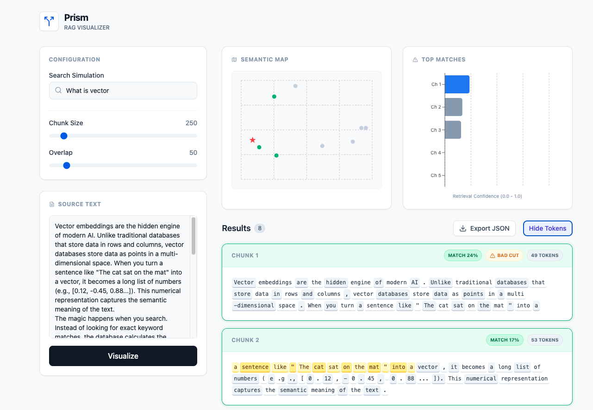

# 💎 Prism: RAG Visualizer

Prism is a full-stack developer tool for visualizing and debugging RAG (Retrieval-Augmented Generation) pipelines. It helps engineers understand how text chunking strategies (Token size, Overlap) affect retrieval accuracy.



## 🚀 Key Features

### 🧠 Visualization & Debugging
-   **2D Semantic Map (PCA):** Visualizes high-dimensional vector embeddings on a 2D plane to show semantic clusters.
-   **Confidence Monitor:** Real-time bar charts showing the TF-IDF score distribution for the top 5 retrieved chunks.
-   **Token "X-Ray" Ribbon:** Toggles between plain text and a color-coded "Matrix View" to visualize exact token boundaries (using `tiktoken`).
-   **Search Term Highlighting:** Explains *why* a chunk matched by highlighting the exact terms found in the query.

### ⚙️ Core Functionality
-   **Real-time Chunking:** Adjustable `chunk_size` and `chunk_overlap` sliders.
-   **Overlap Highlighting:** Visually identifies the context carried over between chunks (yellow highlights).
-   **Export Data:** Download processed chunks and metadata as JSON for offline analysis.

## 🛠️ Tech Stack

**Frontend:**
-   React (Vite)
-   Tailwind CSS (Styling)
-   Recharts (Data Visualization)
-   Lucide React (Icons)

**Backend:**
-   Python (FastAPI)
-   LangChain (Splitting logic)
-   Scikit-learn (TF-IDF Search)
-   Tiktoken (OpenAI Tokenization)

## 📦 How to Run

## ⚡ Quick Start

### Prerequisites
* Python 3.8 or higher
* Git

### Installation

1.  **Clone the repository**
    ```bash
    git clone [https://github.com/hasibullah1811/prism.git](https://github.com/hasibullah1811/prism.git)
    cd prism
    ```

2. **Start the Backend (Python)**
Navigate to the backend folder and activate the environment:

```bash
cd backend
# Activate virtual environment
source venv/bin/activate  # Windows: venv\Scripts\activate

# Install dependencies
pip install -r requirements.txt

# Run Server
uvicorn main:app --reload
```
Server running at: http://127.0.0.1:8000

3. **Start the Frontend (React)**
Open a new terminal and navigate to the frontend folder:
```bash
cd frontend

# Install Node modules
npm install

# Run Frontend
npm run dev
```
App running at: http://localhost:5173

## 🧠 Why this tool?
Building RAG pipelines involves many "silent" failures. If a document is split mid-sentence, or if the overlap is too small, the LLM loses context. Prism makes these invisible data issues visible, allowing engineers to tune their chunking parameters before deploying to production.

Created by hasibullah1811